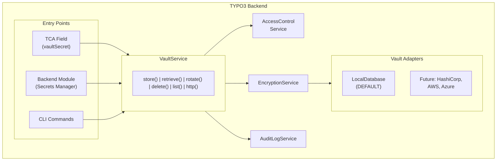
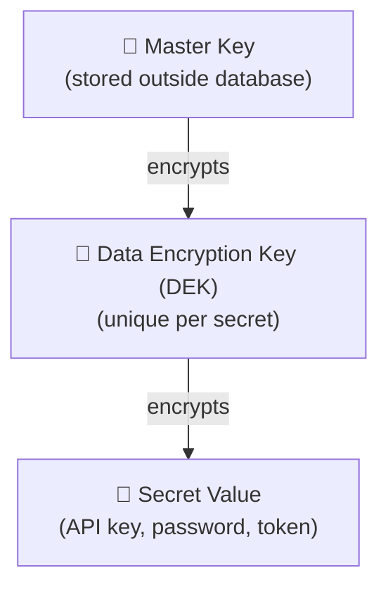

# nr-vault: Secure Secrets Management for TYPO3

[](https://github.com/netresearch/t3x-nr-vault/actions/workflows/tests.yml)
[](https://codecov.io/gh/netresearch/t3x-nr-vault)
[](https://github.com/netresearch/t3x-nr-vault/actions/workflows/security.yml)
[](https://securityscorecards.dev/viewer/?uri=github.com/netresearch/t3x-nr-vault)
[](https://www.bestpractices.dev/projects/11695)
[](https://typo3.org/)
[](https://www.php.net/)
[](https://phpstan.org/)
[](LICENSE)
[](https://github.com/netresearch/t3x-nr-vault/releases)

A TYPO3 v14 extension providing centralized, secure storage for API keys, credentials, and other secrets with encryption at rest, access control, audit logging, and a secure HTTP client.

## Problem Statement

TYPO3 lacks a proper secrets management solution. Current approaches are inadequate:

| Approach | Problem |
|----------|---------|
| TCA `type=password` | Hashes by default (irreversible) or stores plaintext |
| Extension configuration | Stored in `LocalConfiguration.php` (often in git) |
| Environment variables | Not suitable for multi-user, runtime-configurable secrets |
| Database plaintext | No encryption, exposed in backups, SQL injection risk |

Every extension that needs to store API keys reinvents this wheel, often insecurely.

## Solution

nr-vault provides:

- **Envelope encryption** with AES-256-GCM via libsodium
- **Master key management** (file, environment variable, or derived)
- **Per-secret access control** via backend user groups with context scoping
- **Audit logging** of all secret access with tamper-evident hash chain
- **Key rotation** support for both secrets and master key
- **TCA integration** via custom `vaultSecret` field type
- **Vault HTTP Client** - make authenticated API calls without exposing secrets
- **CLI commands** for DevOps automation
- **Pluggable adapter architecture** (external vault adapters planned for future releases)

## Architecture



## Encryption Model

Uses **envelope encryption** (same pattern as AWS KMS, Google Cloud KMS):



Benefits:
- Master key rotation only requires re-encrypting DEKs (fast)
- Each secret has unique encryption
- Compromise of one secret doesn't expose others

## Quick Start

### Store and Retrieve Secrets

```php
use Netresearch\NrVault\Service\VaultServiceInterface;

class MyService
{
    public function __construct(
        private readonly VaultServiceInterface $vault,
    ) {}

    public function storeApiKey(string $provider, string $apiKey): void
    {
        $this->vault->store(
            identifier: "my_extension_{$provider}_api_key",
            secret: $apiKey,
            options: [
                'owner' => $GLOBALS['BE_USER']->user['uid'],
                'groups' => [1, 2],  // Admin, Editor groups
                'context' => 'payment',  // Permission scoping
                'expiresAt' => time() + 86400 * 90,  // 90 days
            ]
        );
    }

    public function getApiKey(string $provider): ?string
    {
        return $this->vault->retrieve("my_extension_{$provider}_api_key");
    }
}
```

### Vault HTTP Client

Make authenticated API calls without exposing secrets to your code:

```php
use Netresearch\NrVault\Http\SecretPlacement;
use Netresearch\NrVault\Http\VaultHttpClientInterface;

class PaymentService
{
    public function __construct(
        private readonly VaultHttpClientInterface $httpClient,
    ) {}

    public function chargeCustomer(array $payload): array
    {
        // Secret is injected by vault - never visible to this code
        $response = $this->httpClient->post(
            'https://api.stripe.com/v1/charges',
            [
                'auth_secret' => 'stripe_api_key',
                'placement' => SecretPlacement::Bearer,
                'json' => $payload,
            ],
        );

        return json_decode($response->getBody()->getContents(), true);
    }
}
```

Secret placement options: `Bearer`, `BasicAuth`, `Header`, `QueryParam`, `BodyField`, `ApiKey`, `OAuth2`.

## TCA Integration

```php
'api_key' => [
    'label' => 'API Key',
    'config' => [
        'type' => 'input',
        'renderType' => 'vaultSecret',
        'size' => 30,
    ],
],
```

## CLI Commands

```bash
# Initialize vault (create master key)
vendor/bin/typo3 vault:init

# List secrets (respects access control)
vendor/bin/typo3 vault:list

# Rotate a secret
vendor/bin/typo3 vault:rotate my_secret_id --reason="Scheduled rotation"

# Rotate master key (re-encrypts all DEKs)
vendor/bin/typo3 vault:rotate-master-key --new-key=/path/to/new.key --confirm

# View audit log
vendor/bin/typo3 vault:audit --identifier=my_secret_id --days=30

# Export secrets (encrypted backup)
vendor/bin/typo3 vault:export --output=secrets.enc
```

## Requirements

- **TYPO3**: v14.0+
- **PHP**: ^8.5
- **Extensions**: `ext-sodium` (bundled with PHP)
- **CPU**: AES-NI support recommended (XChaCha20-Poly1305 fallback available)

## Documentation

Full documentation is available in the `Documentation/` folder and can be rendered with the TYPO3 documentation tools.

### Render locally

```bash
docker run --rm -v $(pwd):/project ghcr.io/typo3-documentation/render-guides:latest --progress Documentation
# Open Documentation-GENERATED-temp/Index.html
```

### Planning documents

Internal development documents are available in `docs/`:

- [Architecture](docs/architecture.md) - System architecture overview
- [API Reference](docs/api.md) - Service API documentation
- [Database Schema](docs/database.md) - Database structure
- [Security Considerations](docs/security.md) - Security design decisions
- [Use Cases](docs/use-cases.md) - Supported use cases

## Feature Comparison

| Feature | nr-vault | Drupal Key | Laravel Secrets | Symfony Secrets |
|---------|----------|------------|-----------------|-----------------|
| Envelope encryption | Yes | No | No | No |
| Per-secret DEKs | Yes | No | No | No |
| External vault support | Planned | Pluggable | Limited | HashiCorp |
| Access control | BE groups + context | By key | N/A | N/A |
| Audit logging | Full + hash chain | Limited | None | None |
| TCA/Form integration | Native | Form API | N/A | N/A |
| Key rotation CLI | Yes | Manual | Yes | Yes |
| HTTP client | Yes | No | No | No |
| OAuth auto-refresh | Yes | No | No | No |

## Roadmap

- **Phase 1-5**: Core functionality (current focus)
- **Phase 6**: External adapters (HashiCorp, AWS, Azure) + Optional Rust FFI for zero-PHP-exposure
- **Phase 7**: Service Registry - abstract away both credentials AND endpoints

## Installation

```bash
composer require netresearch/nr-vault
```

Or in DDEV:

```bash
ddev start
ddev install-v14
ddev vault-init
```

## License

GPL-2.0-or-later

---

**[n]** Developed by [Netresearch DTT GmbH](https://www.netresearch.de/) - Enterprise TYPO3 Solutions
